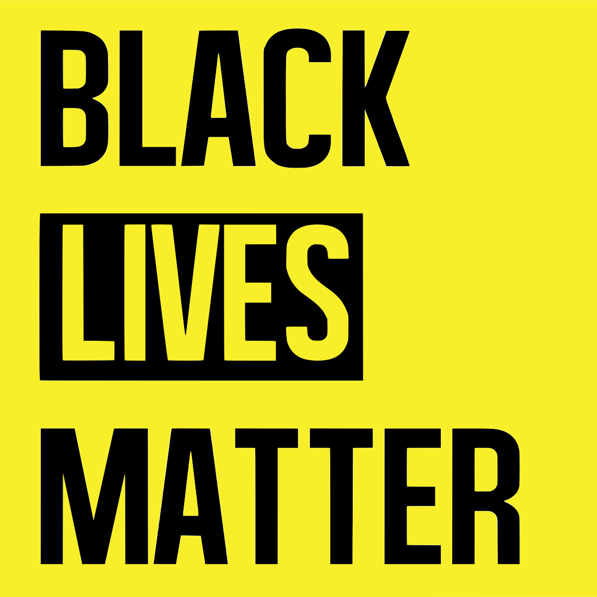
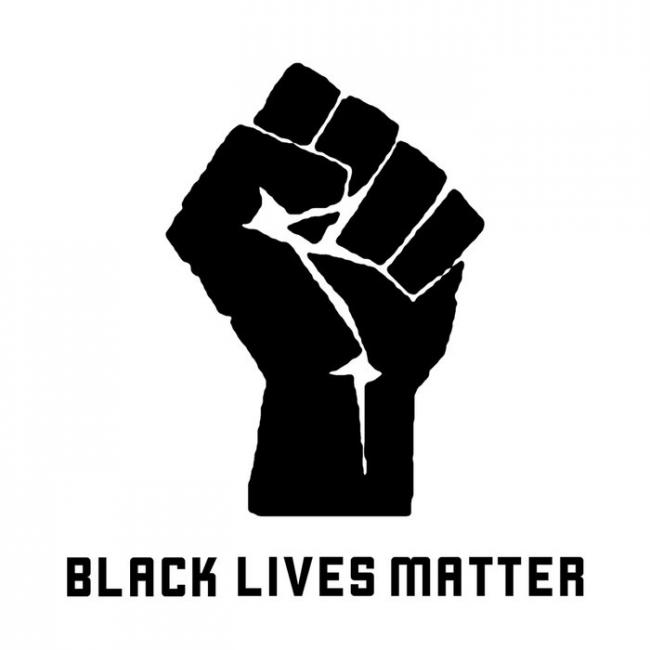

<!DOCTYPE html>
<html>
  <main>
   <header>
     <link type="text/css" rel="stylesheet" href="https://github.com/mgray95/BLMmovement.github.io/master/styles.css">
     This website is a project site for the Gymnasium Modern Web Design Course. It will explore the BLM movement; how and why it began, turning points, and what role it has in today's society. 
    </header>
  </main>

 
<h1>
What is the Black Lives Matter (BLM) Movement?
</h1>

The BLM Movement is an international human rights movement that campaigns against violence and systemic racism towards black people. The BLM organization, as we know it today, was officially <a href="https://blacklivesmatter.com/about/">founded in 2013 </a> by three black activists: Alicia Garza, Patrisse Cullors, and Opal Tometi. They did so in response to George Zimmerman being cleared of all charges in relation to the murder of Trayvon Martin. 
 

<blockquote>
  
I can’t make people not afraid of black people. I don’t know what’s going on. I can’t explain what’s happening in your head. But maybe if I show up every day as a human, a good human, doing wonderful things, loving my family, loving your kids, taking care of things that I care about—maybe, just maybe that work will pick away at the scabs of your discrimination. Maybe that slowly will unravel it. That’s all we have, because we can’t do it for them, because they’re broken. Their brokenness in how they see us is a reflection of this brokenness. And you can’t fix that. All you can do is the work.

  <h3> Michelle Obama</h3>
</blockquote>

<table>
  <tr>
    <td>  </td>
    <td>  </td>
  </tr>
</table>

Although the BLM organization was founded in 2013, it has roots in many historical movements related to black freedom. This includes the Civil Rights movement (50s), Black Power movement (60s), and the Black Feminist movement (80s).

  
 Who is Trayvon Martin?

    
Trayvon Martin was a 17 year old black male from Florida. He was walking back from a convieniance store to a family members home when George Zimmerman, a community watch member, fatally shot Treyvon in the chest. Initially, Zimmerman was not arrested due to Florida's <a href="https://en.wikipedia.org/wiki/Stand-your-ground_law">Stand Your Ground law</a>, a law that gives each person a right to defend themselves and others against threats or perceived threats. This includes applying lethal force even if the situation could have been de-escalated by safely retreating. Only after media coverage of the case spread news far and wide, which led to protests and the first uses of the hashtag #BlackLivesMatter, did the police arrest Zimmerman. Unfortunately, the jurry found him innocent.

BLM Impact/ Success

   
description

  
Counter-slogans and Movements

   
description

  
<a href="https://mgray95.github.io/BLMmovement/ALM.md">
  All Lives Matter</a>

    
description

   
 <a href="https://mgray95.github.io/blueLMmovement/ALM.md">
     Blue Lives Matter</a>

    
description

    
Movement Criticism

    
description

</html>

